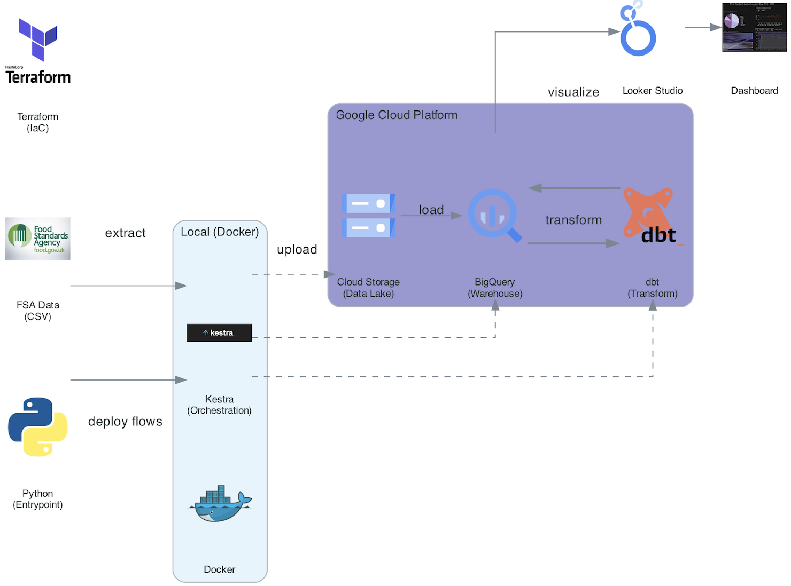
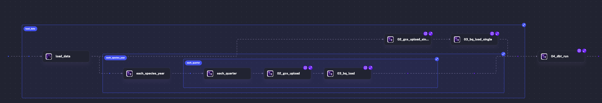
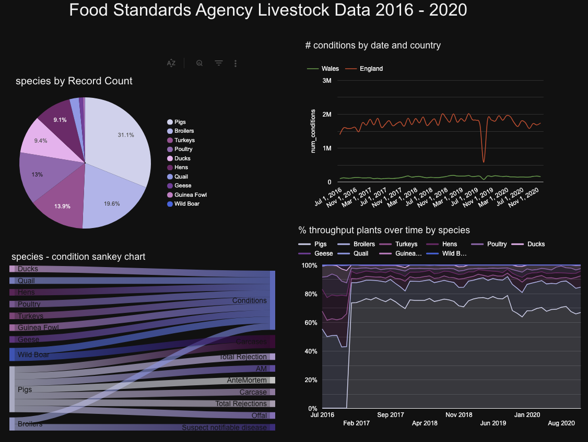

# FSA Livestock Pipeline

## Overview

The FSA Livestock Pipeline is an end-to-end data pipeline that processes livestock inspection data (pig and poultry) from the UK Food Standards Agency (FSA). The pipeline ingests quarterly inspection reports from 2016 to 2020, loads them into a cloud data warehouse, and transforms the data for analysis. The goal is to answer questions such as:

- Which species have the highest inspection volumes?
- How do condition rates vary across countries (England vs Wales)?
- What trends exist in throughput plant percentages over time?
- How are inspection conditions distributed across species?

To replicate/reproduce the pipeline pleease follow the guideline below.

- [guideline](reproduce.md) 

## Dataset

The data is sourced from the [UK Food Standards Agency](https://data.food.gov.uk/) and contains quarterly livestock inspection records for pig and poultry species. Each record includes:

- FSA Poultry conditions data [link here](https://www.data.gov.uk/dataset/c7c438e8-86b4-4ceb-9015-a84afac2cb22/poultry-conditions)

- FSA Pig conditions data [link here](https://www.data.gov.uk/dataset/3e5a96e3-75b2-4226-9c95-b74b1c4ea96d/pig-conditions)

    - Species and inspection type
    - Condition identified during inspection
    - Year and month of inspection
    - Country (England or Wales)
    - Number of conditions, throughput, and throughput plant counts
    - Percentage of throughput

## Technologies

- **Docker** (containerization)
- **Python** (data ingestion)
- **Terraform** (infrastructure as code)
- **Kestra** (workflow orchestration)
- **Google Cloud Storage** (data lake)
- **BigQuery** (data warehouse)
- **dbt** (data transformation)
- **Looker Studio** (data visualization)

## Architecture

Whole pipeline architecture. 

Kestra flow architecture

## Dashboard

View the Looker Studio dashboard [here](https://datastudio.google.com/s/vxL2rEOQw1s).

## ToDo

 - Extend to add other species conditions data [link](https://www.data.gov.uk/dataset/9607543e-2deb-41d7-ac9c-a38f952d31a7/other-species-conditions-data)

