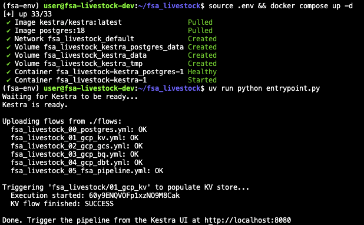
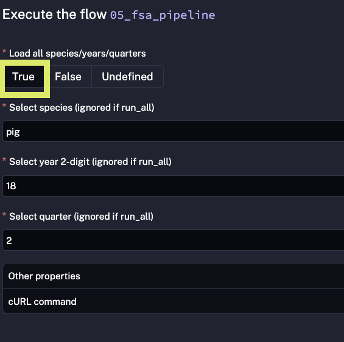
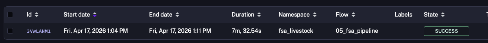
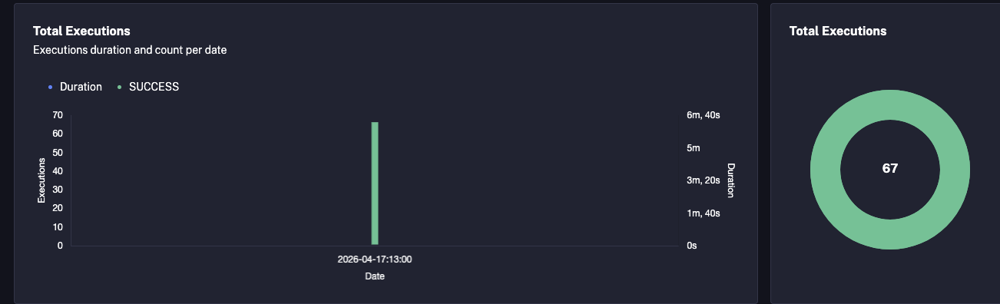

# Reproduction Guide

Step-by-step instructions to reproduce the FSA Livestock Pipeline from scratch.

## Prerequisites

- [Google Cloud SDK](https://cloud.google.com/sdk/docs/install) (`gcloud` CLI)
- [Terraform](https://developer.hashicorp.com/terraform/install) (>= 1.0)
- [Docker](https://docs.docker.com/get-docker/) and Docker Compose
- [Python 3.10+](https://www.python.org/downloads/) with `pip` (or [uv](https://github.com/astral-sh/uv))
- A GCP project with billing enabled

## 1. Clone the Repository

```bash
git clone https://github.com/dv6744/fsa_livestock.git
cd fsa_livestock
```

## 2. GCP Authentication

Authenticate with your Google account and set the target project:

```bash
gcloud auth login
gcloud config set project <YOUR_PROJECT_ID>
```

## 3. Create a Service Account for Terraform

Create a service account that Terraform will impersonate (no key file needed):

```bash
gcloud iam service-accounts create terraform-sa \
  --display-name="Terraform Service Account" \
  --project=<YOUR_PROJECT_ID>
```

Grant it the required roles:

```bash
gcloud projects add-iam-policy-binding <YOUR_PROJECT_ID> \
  --member="serviceAccount:terraform-sa@<YOUR_PROJECT_ID>.iam.gserviceaccount.com" \
  --role="roles/storage.admin"

gcloud projects add-iam-policy-binding <YOUR_PROJECT_ID> \
  --member="serviceAccount:terraform-sa@<YOUR_PROJECT_ID>.iam.gserviceaccount.com" \
  --role="roles/bigquery.admin"
```

Allow your user account to impersonate the service account:

```bash
gcloud iam service-accounts add-iam-policy-binding \
  terraform-sa@<YOUR_PROJECT_ID>.iam.gserviceaccount.com \
  --member="user:<YOUR_EMAIL>" \
  --role="roles/iam.serviceAccountTokenCreator"
```

## 4. Set Up Application Default Credentials

```bash
gcloud auth application-default login
```

This lets both Terraform and the pipeline authenticate via ADC without managing key files.

## 5. Configure Environment Variables

Copy the example `.env` and fill in your values:

```bash
# .env
export TF_VAR_project=<YOUR_PROJECT_ID>
export TF_VAR_location=<YOUR_GCP_LOCATION>       
export TF_VAR_region=<YOUR_GCP_REGION>                
export TF_VAR_bq_dataset_name=<YOUR_BQ_DATASET>     
export TF_VAR_gcs_bucket_name=<YOUR_GCS_BUCKET>      

# dbt
export DBT_DATABASE=${TF_VAR_project}
export DBT_SCHEMA=${TF_VAR_bq_dataset_name}

# service account impersonation
export GCP_SA_IMPERSONATE=terraform-sa@${TF_VAR_project}.iam.gserviceaccount.com
export TF_VAR_impersonate_sa=${GCP_SA_IMPERSONATE}
```

Load the variables:

```bash
source .env
```

## 6. Provision Infrastructure with Terraform

```bash
terraform -chdir=terraform init
terraform -chdir=terraform plan
terraform -chdir=terraform apply
```

This creates:
- A GCS bucket (data lake)
- A BigQuery dataset (data warehouse)

## 7. Start Kestra and Deploy Flows

Launch the Kestra orchestrator, deploy flows, and populate the KV store:

Using pip:
```bash
pip install requests python-dotenv pyyaml
source .env && docker compose up -d
source .env && python entrypoint.py
```

Using [uv](https://github.com/astral-sh/uv) (as shown in the screenshot below):
```bash
source .env && docker compose up -d
uv run --with requests --with python-dotenv --with pyyaml python entrypoint.py
```

The entrypoint script waits for Kestra to be ready, uploads all flow definitions from `./flows`, and triggers the KV store flow to populate environment variables and ADC credentials.



## 8. Run the Pipeline

Open the Kestra UI at [http://localhost:8080](http://localhost:8080) and log in:
- **Username:** `admin@kestra.io`
- **Password:** `Admin1234!`


| Flow | Description |
|------|-------------|
| `01_gcp_kv` | Populates Kestra KV store with GCP config |
| `02_gcp_gcs` | Downloads CSVs from FSA and uploads to GCS |
| `03_gcp_bq` | Loads CSV data from GCS into BigQuery |
| `04_gcp_dbt` | Runs dbt transformations (staging + intermediate models) |
| `05_fsa_pipeline` | Orchestrates flows 02-04 across all species, years, and quarters |

Navigate to the `fsa_livestock` namespace and trigger the `05_fsa_pipeline` flow. Make sure the that True is selected such as to iterate through all species and years . This orchestrates the full pipeline:




After completion the main kestra dashboard and execution of `05_fsa_pipeline` should look similar to below.




## 9. View the Dashboard

Once the pipeline completes, the transformed data is available in BigQuery. Connect Looker Studio to the `int_fsa_livestock_unioned` table to visualize the results.

Tutorial for looker studio [link here](https://www.youtube.com/watch?v=sewifdXqrQ8)

Example dashboard [here](https://datastudio.google.com/s/vxL2rEOQw1s).

## Delete gcp resources used

To destroy all cloud resources:

```bash
source .env
terraform -chdir=terraform destroy
```

To stop Kestra:

```bash
docker compose down
```
